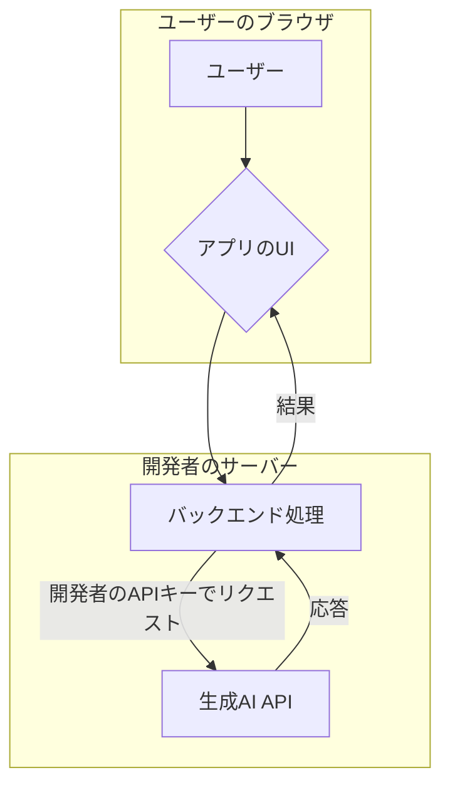
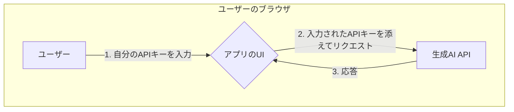

# 【比較】MCP公開時のAPI利用料の支払いモデル

## 概要

MCP（**Model Context Protocol**：Anthropic が提唱した、AIアプリと外部データ・ツールを接続するオープンな標準プロトコル）を使ったサーバーやサービスを公開すると、「内部で呼び出す生成AIのAPI利用料を誰が支払うのか」という設計判断が必要になります。

重要な前提として、**MCP 仕様自体は課金や API キーの負担者を一切定めていません**。MCP は「ホスト（AIアプリ）・クライアント（コネクタ）・サーバー（コンテキストやツールを提供する側）」の通信規約を定めるだけで、「AIアプリが LLM をどう使い、コストをどう負担するか」はアプリケーション側の設計に委ねられています（公式仕様にも "MCP focuses solely on the protocol for context exchange—it does not dictate how AI applications use LLMs or manage the provided context" と明記）。

そのため支払いモデルは、MCP に限らず生成AIを組み込んだサービス全般で問われる論点であり、主に2つのモデルに整理できます。

## 詳細比較

| 観点 | モデル1：開発者が支払う | モデル2：ユーザーが支払う（BYOK） |
| :--- | :--- | :--- |
| **APIキーの持ち主** | 開発者（サーバー/コード側に設定） | ユーザー（自分のキーを入力・設定） |
| **料金の請求先** | 開発者のアカウント | ユーザーのアカウント |
| **ユーザーの手間** | 少ない（キー不要ですぐ試せる） | 多い（キー取得・設定が必要） |
| **開発者のコスト負担** | 大きい（人気が出るほど増加） | ほぼゼロ |
| **典型例** | SaaS型・無料お試しを提供するWebサービス | 多くのデスクトップ向けAIアプリ、開発者向けツール |
| **MCPでの該当箇所** | サーバー側でLLM SDKを直接呼ぶ実装 | クライアント/ホスト側の LLM を使う（後述の sampling 等） |

### 1. 開発者が支払うモデル

WebサイトやサービスにAI機能を組み込む際、内部で呼び出す生成AIのAPIキーを、開発者自身のものとしてサーバーの設定に含めます。

- **仕組み**:
    1. ユーザーがWeb上のサービス（MCPサーバーを内包したアプリ等）を利用します。
    2. サーバー（バックエンド）は、**開発者があらかじめ設定しておいたAPIキー**を使って生成AI（例: OpenAI / Anthropic のAPI）にリクエストを送ります。
    3. 利用料金は、そのAPIキーの発行元である開発者のアカウントに請求されます。

ユーザーがAPIキーを持っていなくても手軽に試せる利点がありますが、人気が出ると開発者の負担が大きくなる課題があります。

### 2. ユーザーが支払うモデル（BYOK）

「ユーザー自身のAPIキーを使ってもらう（Bring Your Own Key）」仕組みを構築します。

- **仕組み**:
    1. ユーザーは、利用したい生成AIサービス（例: OpenAI / Anthropic）で**自分自身のAPIキー**を取得します。
    2. アプリ上で、そのAPIキーを入力・設定する場所が提供されています。
    3. アプリは、**ユーザーが入力したAPIキー**を使って生成AIにリクエストを送ります。
    4. 結果として、利用料金はAPIキーの持ち主であるユーザーのアカウントに請求されます。

開発者はAPI利用料を負担しなくて済みますが、ユーザーにキーを取得・設定してもらう手間が発生します。多くのPC向けAIアプリケーションでこの方式が採用されています。

### MCP の構造と「誰のLLMを使うか」

MCP のアーキテクチャでは、**MCP サーバー**はツール・リソース・プロンプトを提供する側で、それ自体は LLM を持つとは限りません。LLM を呼ぶのは通常 **ホスト（AIアプリ）側**です。

- サーバー自身が LLM SDK を直接呼ぶ実装にすると → **開発者（サーバー運営者）負担**になりがち（モデル1）。
- MCP の **sampling**（`sampling/createMessage`）機能を使うと、サーバーは LLM SDK を持たずに**ホスト側のLLM**へ補完を依頼できます。この場合、トークン費用は**ホスト（＝ユーザーが使うAIアプリ）側**で発生し、結果的にユーザー負担（モデル2）に近づきます。

つまり「どこで LLM を呼ぶか（サーバー側かホスト側か）」が、そのまま「誰が支払うか」に直結します。

## 処理フロー図

**モデル1：開発者支払い（サーバー側でLLMを呼ぶ）**

**モデル2：ユーザー支払い（自分のキーを使う）**

（※モデル2の図は、ユーザー側から直接APIを呼ぶシンプルな例です。MCP の sampling を使う場合は、ホストアプリがユーザーの設定したキーで LLM を呼ぶ形になります）

## よくある誤解

- **誤解1：「MCP は Model-Customized Persona の略」** — 誤りです。MCP は **Model Context Protocol**（Anthropic が2024年11月に発表したオープン標準）であり、AIアプリと外部データ・ツールを接続するためのプロトコルです。「ペルソナ」や「カスタムキャラクター」を作る仕組みではありません。
- **誤解2：「MCP の仕様が課金方法を決めている」** — 決めていません。MCP 公式は「コンテキスト交換のプロトコルにのみ注力し、AIアプリが LLM をどう使うかは規定しない」と明言しています。支払いモデルは完全にアプリケーション側の設計事項です。
- **誤解3：「MCPサーバー＝Webでホストされたチャットアプリ」** — 不正確です。MCP の用語では、**サーバー**はツール/リソース/プロンプトを提供するプログラム（ローカルでもリモートでも可）、**ホスト**が AIアプリ本体、**クライアント**はホスト内でサーバーへ接続するコネクタです。
- **誤解4：「MCPサーバーは必ず自前のLLMを呼ぶ」** — 必須ではありません。sampling 機能を使えば、サーバーは LLM SDK を持たずにホスト側のモデルへ補完を依頼でき、これが費用負担者にも影響します。

## 実務での選び分け

- **無料お試し・摩擦の少ないオンボーディングを最優先（SaaS等）** → **モデル1（開発者支払い）**。ただしレート制限・上限・従量課金の転嫁を設計しないと赤字リスク。
- **コスト負担を避けたい／パワーユーザー・開発者向けツール** → **モデル2（BYOK）**。導入ハードルは上がるが運営コストはほぼゼロ。
- **MCPサーバーをモデル非依存に作りたい** → サーバー側にLLM SDKを持たず、**sampling でホストのLLMに委譲**（費用はホスト側＝実質ユーザー寄り）。
- **判断軸**: ①誰のコスト負担が許容できるか、②ユーザーにキー取得を求められるユーザー層か、③LLMをサーバー側で呼ぶ必要があるか（Yesならモデル1寄り）、④モデル非依存にしたいか（Yesなら sampling）。

## ひとことまとめ

MCP 自体は課金を規定しません。支払いは「LLM をサーバー側で呼ぶ＝開発者負担」か「ユーザーのキー（BYOK）／sampling でホスト側に委譲＝ユーザー負担」かの設計判断であり、対象ユーザー層とコスト許容度で選び分けます。

## 出典・参考

- [What is the Model Context Protocol (MCP)?（公式 introduction）](https://modelcontextprotocol.io/introduction)
- [MCP Architecture overview（ホスト/クライアント/サーバーの定義・sampling）](https://modelcontextprotocol.io/docs/learn/architecture)
- [MCP Specification 2025-11-25（仕様。課金は規定しない旨）](https://modelcontextprotocol.io/specification/2025-11-25)
- [Introducing the Model Context Protocol（Anthropic 公式発表）](https://www.anthropic.com/news/model-context-protocol)
