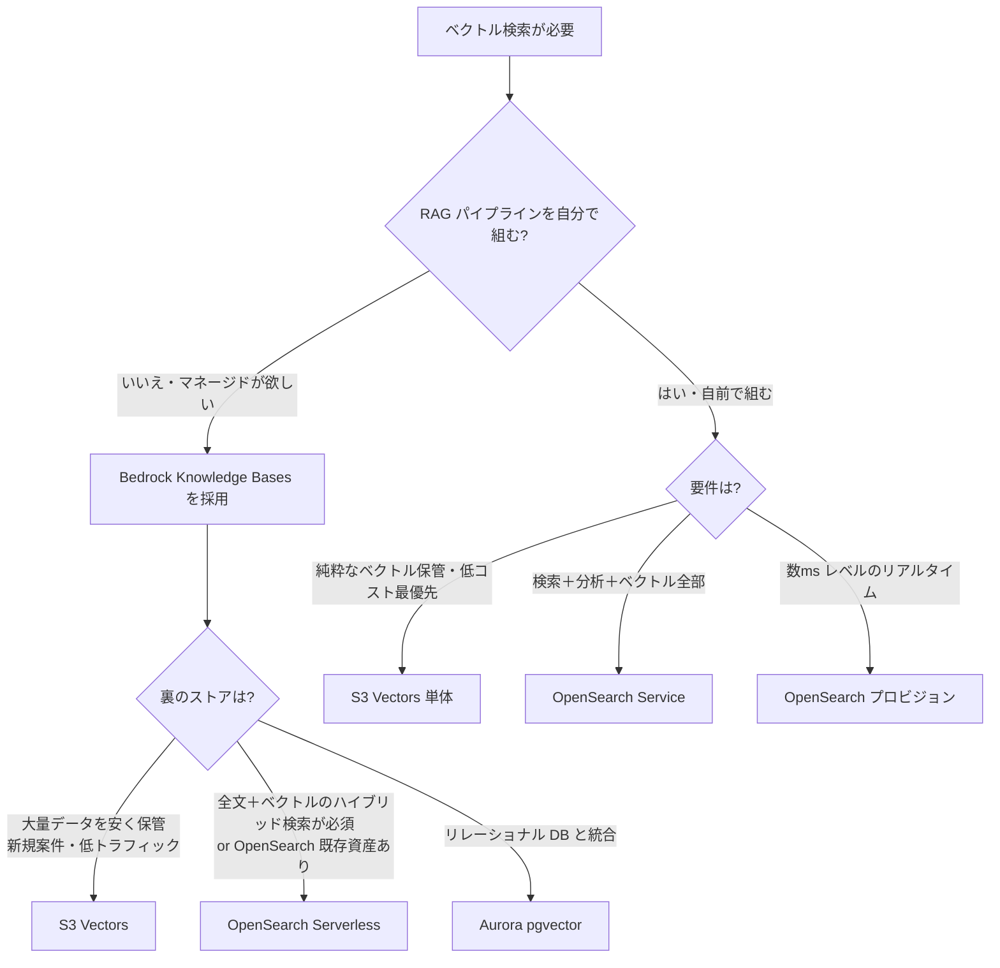

# 【比較】S3 Vectors / Bedrock Knowledge Bases / OpenSearch の違い

## 概要

AWS で RAG（Retrieval-Augmented Generation）基盤を組むときに必ず混乱するのが、**Amazon S3 Vectors**・**Amazon Bedrock Knowledge Bases**・**Amazon OpenSearch Service** の3つです。「どれを選べばいいか」と聞かれることが多いですが、実はこの3つは **同じレイヤーの選択肢ではありません**。

- **Bedrock Knowledge Bases** … RAG パイプラインを丸ごとマネージドにする「上位サービス」（ingestion / chunking / embedding / retrieval API を一括提供）
- **S3 Vectors** … Bedrock KB が裏で使う「ベクトル保管庫」の一種。2025年12月に GA、ベクトル特化のストレージ・クエリ層（最大90%安い）
- **OpenSearch Service** … 全文検索＋ベクトル検索ができる汎用検索エンジン。Bedrock KB の裏側にも採用可能（OpenSearch Serverless）

つまり Bedrock KB を **「RAG オーケストレーター」** と捉え、その裏のベクトル保管に **S3 Vectors** か **OpenSearch** を選ぶ、という二段構えで考えると整理しやすくなります（さらに pgvector や Pinecone も選べます）。本記事は **2026-05 時点** の最新仕様で違いをまとめます。

## 詳細比較

| 項目 | S3 Vectors | Bedrock Knowledge Bases | OpenSearch Service |
| --- | --- | --- | --- |
| **レイヤー** | ベクトル保管（Storage層） | RAG オーケストレーション（上位サービス） | 検索エンジン（Storage＋検索層） |
| **主用途** | 大量ベクトルの低コスト保管・検索 | RAG パイプライン全体の自動化 | 全文＋ベクトル＋ハイブリッド検索／ログ分析 |
| **GA 時期** | 2025年12月 | 2023年（KB機能） | 2021年（OpenSearch）／Serverless 2023 |
| **課金単位** | PUT(GB) ＋ Storage(GB-月) ＋ Query($/Mリクエスト＋$/TB) | KB自体は無料。裏のベクトルストア＋埋め込み＋parsing が別課金 | プロビジョン: インスタンス時間。Serverless: OCU($0.24/h) |
| **最小コスト目安** | クエリ依存（保管だけならほぼ0円スタート可能） | 裏のストア依存（S3 Vectors なら最安、OpenSearch Serverless なら下記） | Serverless 本番最小 約**$350/月**（4 OCU）、dev-test で半額 |
| **スケール上限** | 1インデックス 20億ベクトル / 1バケット 20兆ベクトル | 裏のストア依存 | k-NN 最大 16,000次元、ノード追加でスケール |
| **クエリレイテンシ** | Cold sub-second / Warm 〜100ms | 裏のストア依存（S3V: warm 100ms / OS Serverless: 数十ms） | プロビジョン: 数ms〜数十ms / Serverless: 〜100ms |
| **ハイブリッド検索（全文＋ベクトル）** | ❌（ベクトル特化） | ✅（裏が OpenSearch のときのみ） | ✅（BM25 ＋ k-NN ＋ rerank） |
| **マルチモーダル対応** | ✅（GA時にtext/image/audio/video の埋め込み保管が可能） | ✅（2025 re:Invent で multimodal retrieval 追加） | ✅（埋め込みを自前で投入する場合） |
| **東京リージョン** | ✅（2025-12 GA時に追加） | ✅ | ✅ |
| **運用負荷** | 低（マネージドストレージ） | 最小（フルマネージドRAG） | 中〜高（プロビジョン管理 or Serverless OCU 管理） |
| **Bedrock KB との関係** | KB の vector store として選択可（推奨デフォルト） | KB そのもの | KB の vector store として選択可（従来デフォルト） |

> 📅 **取得日**: 2026-05-20。AWS の機能・価格は変化が速いため、本番採用時は必ず一次ソース（後述「出典・参考」）で再確認してください。

## よくある誤解

### 誤解1: 「S3 Vectors vs OpenSearch でどっちを選ぶか」

両者は **直接の競合ではなく**、Bedrock KB の裏側で **どちらを使うか** の選択肢です（pgvector / Pinecone / MongoDB Atlas / Redis Enterprise も候補）。フラットに「どっち？」と考えるよりも、「Bedrock KB を使うか／使わないか」「ハイブリッド検索が必要か」を先に決めるのが正解です。

### 誤解2: 「Bedrock Knowledge Bases は単独で課金される」

KB 自体には別途料金は発生しません。料金が発生するのは:

1. 裏側のベクトルストア（S3 Vectors / OpenSearch Serverless 等）
2. 埋め込みモデルの推論（入力トークン課金）
3. Bedrock Data Automation での parsing（$0.010 / page）
4. Amazon Rerank 1.0（$1.00 / 1,000 reranking queries）

「Knowledge Bases 自体は無料、選んだストアと埋め込みが課金対象」と覚えると良いです。

### 誤解3: 「OpenSearch Serverless は安い」

サーバーレスでもベクトル検索は **最低 4 OCU = 約 $350/月** が発生します（dev-test なら半額）。これは「使わなくても発生する固定費」なので、トラフィックが少ない小規模 RAG では S3 Vectors の従量課金のほうが圧倒的に安くなります（AWS 公式で **最大90%コスト削減**）。

### 誤解4: 「S3 Vectors は安いが性能が劣る」

GA 後の S3 Vectors は **warm クエリで 100ms 前後** のレイテンシが出るため、対話型 RAG でも十分実用域です。ただし数 ms 単位のリアルタイム要件（広告配信・レコメンドのインライン推論）には OpenSearch プロビジョンのほうが向きます。

## 実務での選び分け

### 判断軸の早見表

| こういうとき | 推奨 |
| --- | --- |
| 小規模 RAG・PoC・コスト最優先 | **Bedrock KB ＋ S3 Vectors**（AWS公式が2026年の新規案件デフォルトとして推奨） |
| 既存 OpenSearch クラスタに RAG を相乗り | **Bedrock KB ＋ OpenSearch Serverless** |
| 全文＋ベクトルのハイブリッド検索が必須 | **OpenSearch Service**（プロビジョン or Serverless） |
| 数ms 単位のレイテンシ要件（広告・レコメンド） | **OpenSearch プロビジョン**（インスタンス常時稼働） |
| 大量・低頻度クエリで保管コスト最重要 | **S3 Vectors 単体**（20億ベクトル/index・最大90%安） |
| アーキテクチャを自前で組みたい | **S3 Vectors または OpenSearch 単体**（Bedrock KB は使わない） |
| マルチモーダル（画像・音声・動画）RAG | **Bedrock KB**（2025 re:Invent で multimodal retrieval 追加） |

## ひとことまとめ

**Bedrock Knowledge Bases は「RAG の司令塔」、S3 Vectors と OpenSearch はその「保管庫の選択肢」**です。2026年の新規案件は **Bedrock KB ＋ S3 Vectors が AWS 公式の推奨デフォルト**（既存 OpenSearch 資産またはハイブリッド検索が必須でなければ）。3つを「同列の選択肢」と捉えると混乱するので、**まず Bedrock KB を使うかを決め、次に裏のストアを選ぶ**という二段構えで考えるのがおすすめです。

## 出典・参考

> 📅 全リンク取得日: **2026-05-20**

- [Amazon S3 Vectors（AWS 公式ページ）](https://aws.amazon.com/s3/features/vectors/)
- [Amazon S3 Vectors now generally available with increased scale and performance（AWS Blog, 2025-12）](https://aws.amazon.com/blogs/aws/amazon-s3-vectors-now-generally-available-with-increased-scale-and-performance/)
- [Amazon S3 Vectors is now generally available with 40 times the scale of preview（AWS What's New, 2025-12）](https://aws.amazon.com/about-aws/whats-new/2025/12/amazon-s3-vectors-generally-available/)
- [Using S3 Vectors with Amazon Bedrock Knowledge Bases（AWS 公式ドキュメント）](https://docs.aws.amazon.com/AmazonS3/latest/userguide/s3-vectors-bedrock-kb.html)
- [Amazon Bedrock Pricing（AWS 公式）](https://aws.amazon.com/bedrock/pricing/)
- [Amazon OpenSearch Service - Pricing（AWS 公式）](https://aws.amazon.com/opensearch-service/pricing/)
- [Vector Database for Amazon OpenSearch Service（AWS 公式）](https://aws.amazon.com/opensearch-service/serverless-vector-database/)
- [k-Nearest Neighbor (k-NN) search in Amazon OpenSearch Service（AWS 公式ドキュメント）](https://docs.aws.amazon.com/opensearch-service/latest/developerguide/knn.html)
- [AWS claims 90% vector cost savings with S3 Vectors GA（VentureBeat, 2026-01）](https://venturebeat.com/infrastructure/aws-claims-90-vector-cost-savings-with-s3-vectors-ga-calls-it-complementary)
- [Amazon S3 Vectors Reaches GA, Introducing "Storage-First" Architecture for RAG（InfoQ, 2026-01）](https://www.infoq.com/news/2026/01/aws-s3-vectors-ga/)
