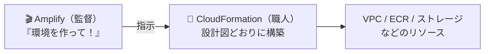

# 【比較】AmplifyとCloudFormationとCloudFrontの違い

AWS の **Amplify（アンプリファイ）**・**CloudFormation（クラウドフォーメーション）**・**CloudFront（クラウドフロント）** は、名前が似ていて混同されがちですが、担当する工程がまったく異なる別サービスです。このドキュメントでは、3つの役割と相互の関係性を整理します。

## 概要

| サービス名 | カテゴリ | 主な目的 |
| --- | --- | --- |
| **Amplify** | 開発・デプロイ自動化 | Web/モバイルアプリを素早く開発・公開するオールインワン環境 |
| **CloudFormation** | IaC（インフラ構築自動化） | コードの「設計図」からAWSリソース群を自動で組み立てる |
| **CloudFront** | CDN（コンテンツ配信） | 世界中にコピーを配置してコンテンツを高速配信する |

ひとことで言うと、**Amplify＝「監督」**、**CloudFormation＝「職人」**、**CloudFront＝「世界中への配達網」** です。Amplify でアプリを公開すると、その裏側では CloudFormation が実際のインフラを組み立て、CloudFront が画面を世界中へ高速配信する、という分業になっています。

## 詳細比較

### 1. AWS Amplify（開発・デプロイの自動化ツール）

Amplify は、Web アプリやモバイルアプリを「素早く開発・デプロイするためのオールインワン環境」です。

- **オールインワン**: 画面ポチポチや簡単なコマンドだけで、フロントエンドの画面公開から裏側のサービスまでまとめて構築できる。
- **裏側リソースの自動生成**: データベース（DynamoDB）、認証機能（Cognito）、AI 環境（AgentCore など）を自動で用意してくれる。
- **立ち位置**: 開発者が「これを作って」と指示を出す監督役。内部実装の多くは CloudFormation に委譲している。

**Amplify の役割は、アプリ開発に必要な一式を最短距離で立ち上げ、公開まで面倒を見ることです。**

### 2. AWS CloudFormation（インフラの「設計図」をもとに構築する職人）

CloudFormation は、AWS のあらゆるリソース（VPC、EC2、データベースなど）を「コード（テキストファイルの設計図）」に基づいて自動で組み立てるサービス（IaC＝Infrastructure as Code）です。

- **設計図ベース**: テンプレート（設計図）に書かれた内容どおりにリソースを構築する。
- **スタック単位の管理**: 関連リソースを「スタック」としてまとめて作成・更新・削除する。
- **Amplify の裏方**: 実は Amplify の裏側ではこの CloudFormation が動いている。

**CloudFormation の役割は、設計図に従ってインフラを正確・再現可能に組み立て、まとめて管理することです。**

#### Amplify と CloudFormation の関係（例え話）

- **Amplify（監督）**: 「AI エージェントの環境を作って！」と指示を出す。
- **CloudFormation（職人）**: 「了解、じゃあこの設計図（スタック）通りに、VPC を作って、ECR を作って、ストレージを確保するね」と裏でコツコツ組み立てる。

この主従関係があるため、**Amplify を削除すると、監督（Amplify）が職人（CloudFormation）に「あの時作ったやつ、全部片付けといて！」と自動で命令を出す**ため、CloudFormation 側のスタック（リソース）も連動して消えます。

### 3. AWS CloudFront（世界中に配信するキャッシュサーバー／CDN）

CloudFront は、世界中にデータを高速で配信するための「キャッシュサーバー（CDN＝Content Delivery Network）」です。

- **エッジ配信**: 世界中のサーバー（エッジロケーション）に画面（コンテンツ）のコピーを配る。
- **高速表示**: ユーザーがどこからアクセスしても、近くのサーバーから配信されるため一瞬でページが開く。
- **Amplify との関係**: Amplify で Web サイトを公開すると、その配信を CloudFront が裏側で担い、表示を高速化している。

**CloudFront の役割は、出来上がったコンテンツを世界中へ低遅延で届けることです（インフラの構築役ではなく、配信役）。**

## よくある誤解

- **誤解1：「Amplify と CloudFormation は名前が似た同じもの」** — 別物です。Amplify は「開発・デプロイの自動化ツール（監督）」、CloudFormation は「設計図からインフラを組み立てる IaC サービス（職人）」。Amplify が内部で CloudFormation を利用する主従関係であり、同一サービスの別名ではありません。
- **誤解2：「CloudFormation を手動で消さないとリソースが残る」** — Amplify が作ったものについては、**Amplify を削除すれば CloudFormation のスタックも連動して削除される**ため、CloudFormation 側の手動削除は基本的に不要です。
- **誤解3：「CloudFront と CloudFormation は似た名前だから役割も近い」** — 役割は正反対の工程です。CloudFormation は「インフラを構築する」、CloudFront は「出来たコンテンツを配信する」。スペルが似ているだけで担当が異なります。
- **誤解4：「Amplify を使うとインフラを直接いじることになる」** — 通常は Amplify が抽象化してくれるため、利用者が CloudFormation のテンプレートを直接書く必要はありません（裏側で自動的に扱われます）。

## 実務での選び分け

3つは「どれを選ぶか」ではなく「どの工程を担うか」で整理すると分かりやすいです。

- **Amplify を使う場面**:
    - Web/モバイルアプリを素早く立ち上げ、フロント公開から認証・DB まで一気通貫で用意したい。
    - インフラの細部を意識せず、開発に集中したい。

- **CloudFormation を使う場面**:
    - インフラ構成をコード（設計図）で管理し、再現可能・まとめて作成/削除したい。
    - Amplify の枠を超えた独自のリソース構成を、テンプレートで厳密に制御したい。

- **CloudFront を使う場面**:
    - 公開済みサイト/アプリの表示を、世界中のユーザーに対して高速化したい。
    - 画像・動画・静的ファイルなどをキャッシュして配信負荷とレイテンシを下げたい。

- **判断軸**: 工程が「アプリ開発・公開」なら Amplify、「インフラ構築・管理」なら CloudFormation、「コンテンツ配信の高速化」なら CloudFront。多くの構成では、Amplify が監督として CloudFormation に構築させ、出来たサイトを CloudFront が配信する、という連携になります。

## ひとことまとめ

Amplify＝アプリ開発・公開を一括で面倒みる監督、CloudFormation＝設計図どおりにインフラを組み立てる職人、CloudFront＝出来たコンテンツを世界中へ高速配信する配達網。名前は似ていますが工程は別物で、Amplify を消せば裏方の CloudFormation スタックも連動削除されるため、コンソールで見た CloudFormation を手動で消す必要はありません。

| 観点 | Amplify | CloudFormation | CloudFront |
| --- | --- | --- | --- |
| **役割** | 開発・デプロイを**自動化** | 設計図から**インフラ構築** | コンテンツを**高速配信** |
| **例えるなら** | 監督 | 職人 | 世界中の配達網 |
| **関係** | 裏で CloudFormation を動かす | Amplify に呼ばれて構築する | 公開サイトの表示を高速化 |

## 出典・参考

- AWS Amplify 公式（フルスタックアプリの構築・ホスティング。フロントエンドからバックエンドリソースまでを統合）: https://aws.amazon.com/amplify/
- AWS CloudFormation 公式（テンプレートで AWS リソースをモデル化・プロビジョニングする IaC サービス。スタック単位で管理）: https://aws.amazon.com/cloudformation/
- AWS CloudFront 公式（エッジロケーションを使ったコンテンツ配信ネットワーク＝CDN。低遅延・高速配信）: https://aws.amazon.com/cloudfront/
