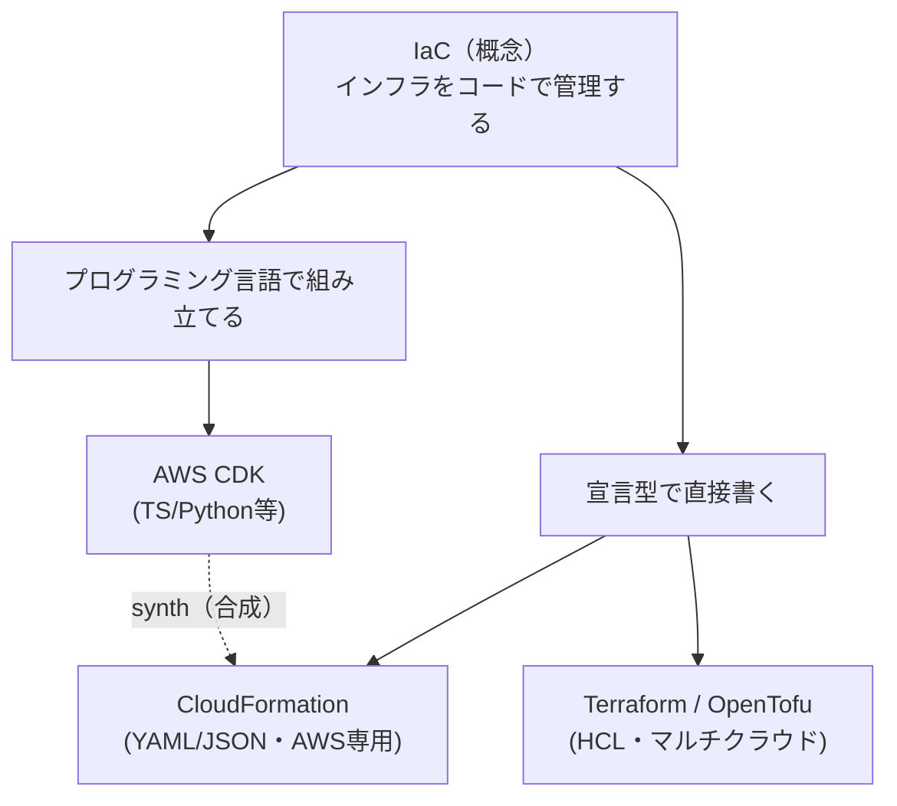

# 【比較】CDK と IaC の違い

## 概要

「CDK と IaC はどう違うのか」はよく聞かれる質問ですが、この2つは**同じ土俵で並べて比べる対象ではありません**。

- **IaC（Infrastructure as Code）**＝「インフラをコードで定義・管理する」という**考え方・プラクティス（概念）**
- **AWS CDK（Cloud Development Kit）**＝その IaC を実現するための**ツール（実装手段）のひとつ**

つまり両者は「料理」と「フライパン」のような**上位概念と道具**の関係で、`CDK ⊂ IaC`（CDK は IaC の一部）です。正しく比較したいなら、比べるべき相手は "IaC" ではなく**同じ IaC ツール同士**、すなわち **CDK vs CloudFormation vs Terraform** になります。

この記事は2部構成です。

- **第1部**：IaC とは何か／その中で CDK がどこに位置するか（概念の整理）
- **第2部**：CDK vs CloudFormation vs Terraform の実務比較（道具の選び分け）

### 第1部：IaC とは何か、CDK はどこにいるか

**IaC** は、サーバー・ネットワーク・DB などのインフラ構成を GUI の手作業ではなく**コード（テキスト）として記述**し、そのコードを実行して環境を構築・変更する考え方です。狙いは「**再現性**」——同じコードから何度でも同じ環境を作れること。これにより、

- 環境構築の高速化・複製（本番/検証を同じ定義から生成）
- 人為ミスの削減とバージョン管理（Git で履歴・差分・レビュー）
- Pull Request / コードレビュー文化をインフラにも適用

が可能になります。

IaC の実装スタイルは大きく2つに分かれます。

- **宣言型（declarative）**：「あるべき状態」を書くと、ツールが差分を計算して適用する。CloudFormation・Terraform が代表。
- **命令型に近い記述（プログラマティック）**：プログラミング言語で"あるべき状態"を組み立てる。**CDK** がここ。CDK は最終的に CloudFormation テンプレート（宣言型）へ**変換（synth）** されて実行されるため、実体は宣言型の上に載る"生成器"です。

CDK のコア概念は3層です。

| 要素 | 説明 |
|------|------|
| **Construct** | 再利用可能なクラウド部品（1リソース〜複数リソースの束） |
| **Stack** | Construct をまとめたデプロイ単位（＝1つの CloudFormation スタックに対応） |
| **App** | 複数の Stack を束ねる最上位 |

対応言語は **TypeScript / JavaScript / Python / Java / C#(.NET) / Go**。`ApplicationLoadBalancedFargateService` のような高レベル Construct を使えば、**数十行で50以上のリソース**を生成でき、条件分岐・ループ・継承・IDE補完・ユニットテストといった"普通のプログラミング"の武器をインフラ定義に持ち込めます。

## 詳細比較

第2部。IaC ツールとして CDK・CloudFormation・Terraform を並べます。

| 項目 | AWS CDK | CloudFormation | Terraform / OpenTofu |
| --- | --- | --- | --- |
| 種別 | IaC "生成"フレームワーク | AWSネイティブ IaC | サードパーティ IaC |
| 記述方法 | プログラミング言語 (TS/Python/Java/C#/Go) | YAML / JSON（宣言型） | HCL（宣言型 DSL） |
| パラダイム | プログラマティック（→宣言型に合成） | 宣言型 | 宣言型 |
| 対応クラウド | AWS 中心 (CDKTFで他クラウドも可) | AWS 専用 | **マルチクラウド**（AWS/Azure/GCP他） |
| 抽象化・再利用 | ◎ Construct/継承/npm等で高い | △ ネスト/モジュール限定的 | ○ Module で再利用 |
| 状態管理 | CloudFormation が管理（state ファイル不要） | AWS 側がスタックで管理（state 不要） | **state ファイルを自前管理**（S3等） |
| 学習コスト | プログラミング経験者は低〜中 | 中（YAMLだが冗長になりやすい） | 中（HCL＋stateの概念） |
| ロールバック | CloudFormation の自動ロールバック | 自動ロールバックあり | 明示的（自動ロールバックなし） |
| ライセンス | Apache 2.0（OSS） | AWS サービス（追加料金なし） | **BSL**（2023.8〜）／OpenTofuは MPL-2.0 |
| 得意な場面 | アプリ開発者主導・複雑な動的構成 | AWSだけで完結・AWS標準に寄せたい | 複数クラウド・エコシステム重視 |

### それぞれの要点

- **AWS CDK**：TypeScript や Python で"アプリを書くように"インフラを書ける。抽象化とテストが強く、大規模・動的な構成に向く。ただし実行時は CloudFormation に合成されるため、**CloudFormation の制約（スタックあたりのリソース上限など）と挙動を理解している必要**がある。AWS 寄り（CDK for Terraform を使えば他クラウドも可能だが主戦場は AWS）。
- **CloudFormation**：AWS 純正の宣言型 IaC。追加料金なしで、AWS の新機能対応も比較的早い。YAML/JSON なので大規模になると記述が冗長・見通しが悪くなりがち。CDK の"出力先"でもある土台。
- **Terraform / OpenTofu**：HCL による宣言型で、**マルチクラウド**が最大の強み。プロバイダのエコシステムが広い。`state` ファイルの管理（ロック・保管場所）が運用上の要点。2023年8月に HashiCorp が Terraform を **BSL（Business Source License）** へ変更し、これを機にコミュニティが MPL 版を fork した **OpenTofu**（Linux Foundation 配下）が登場。2024年12月に **IBM が HashiCorp を買収**したが、Terraform の BSL は継続。ライセンスに敏感な組織は OpenTofu を選ぶ動きがある（2026-07 時点）。

## よくある誤解

- **「CDK と IaC はどちらを使うか選ぶもの」** → ✕。IaC は概念、CDK はその実装。"CDK を使う＝IaC をやっている"ということ。選ぶなら CDK / CloudFormation / Terraform の**ツール間**。
- **「CDK は CloudFormation の代替（置き換え）」** → ✕。CDK は CloudFormation を**置き換えず、その上で動く**。CDK のコードは CloudFormation テンプレートに `synth`（合成）され、デプロイ・状態管理・ロールバックは CloudFormation が担う。
- **「プログラミング言語で書ける＝命令型」** → 半分✕。CDK は言語の力で"あるべき状態"を組み立てるが、最終成果物は宣言型テンプレート。手続きで直接 API を叩くわけではない。
- **「Terraform は無料の OSS」** → 2023年8月以降は **BSL（source-available）** で、完全な OSS ではない。純粋な OSS を求めるなら OpenTofu（MPL-2.0）。
- **「CDK なら AWS 以外も普通に扱える」** → 基本は AWS 向け。他クラウドは CDK for Terraform（CDKTF）など別系統が必要で、無印 CDK の主戦場は AWS。

## 実務での選び分け

判断軸はおおむね「**開発チームの性質**」「**対象クラウド**」「**ライセンス/エコシステム**」の3つです。

- **AWS だけで完結し、アプリ開発者がインフラも書く** → **CDK**。TS/Python でテスト可能・抽象化しやすく、開発体験が良い。
- **AWS だけで完結し、YAML で素直に宣言的に管理したい／依存を増やしたくない** → **CloudFormation**。純正・追加料金なし・新機能追従が速い。
- **複数クラウド（AWS＋Azure/GCP等）を横断管理したい** → **Terraform / OpenTofu**。マルチクラウドとプロバイダ・エコシステムが最大の武器。
- **OSS ライセンスを厳格に求める（BSL を避けたい）** → **OpenTofu**（または CloudFormation/CDK）。
- **チームに TypeScript/Python の素養があり、動的・大規模な構成を DRY に書きたい** → **CDK**。ループ・継承・共通 Construct 化が効く。

迷ったら：**AWS 専業なら CDK か CloudFormation、マルチクラウドなら Terraform/OpenTofu** が第一近似。CDK を選ぶ場合も、裏側の CloudFormation を理解しておくとトラブル対応が速くなります。

## ひとことまとめ

**IaC は「インフラをコードで管理する」概念、CDK はそれを実現するツールの1つ**。だから "CDK vs IaC" ではなく、比べるべきは **CDK vs CloudFormation vs Terraform**——AWS 専業でコードの力を活かすなら CDK、AWS 純正で素直に書くなら CloudFormation、マルチクラウドなら Terraform/OpenTofu、が基本の指針です。

## 出典・参考

- [AWS CDK v2 開発者ガイド（AWS公式）](https://docs.aws.amazon.com/ja_jp/cdk/v2/guide/home.html)
- [IaCツール（CloudFormation / Terraform / CDK）比較の解説記事（Qiita, akira__0924）](https://qiita.com/akira__0924/items/16940370f44bb8e11566)
- [Terraform License Change (BSL) – Impact on Users & Providers（Spacelift）](https://spacelift.io/blog/terraform-license-change)（BSL移行・OpenTofu forkの経緯／2026-07 参照）
- [OpenTofu vs Terraform in 2026: License, Features, and Migration（Encore）](https://encore.dev/articles/opentofu-vs-terraform-2026)（IBM買収後の状況・2026年時点の採用動向／2026-07 参照）
