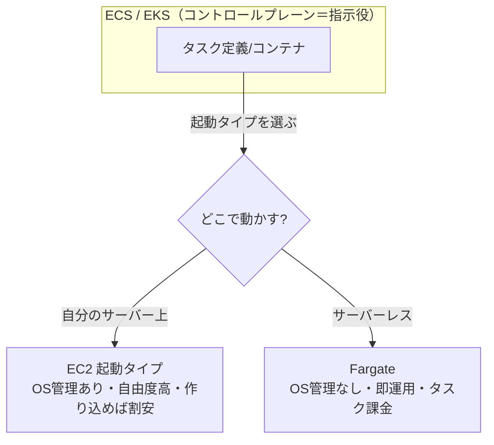

# 【比較】EC2とFargateの違い

AWS でコンテナを動かすときに必ず突き当たる選択、**Amazon EC2** と **AWS Fargate** の違いを、思想・運用・コスト・選び分けの観点で整理します。

!!! note "情報の鮮度について"
    料金・割引プラン・スペック上限は変化が速い項目です。本記事の数値・割引体系は **2026-06 時点**の公開情報に基づきます。採用時は末尾「出典・参考」の公式ページで最新値を確認してください。

## 概要

「EC2 と Fargate」はよく対比されますが、**同じレイヤーのサービスではありません**。正確には、ECS／EKS でコンテナを動かす際の**「起動タイプ（どこでコンテナを実行するか）」の2択**です。

- **EC2 起動タイプ** … 自分で用意した仮想サーバー（EC2インスタンス）の上でコンテナを動かす。サーバーは「自分の持ち物」。
- **Fargate 起動タイプ** … サーバーの存在を意識せず、コンテナ単位で実行をAWSに丸投げする**サーバーレス**方式。サーバーは「AWSの持ち物」。

最大の違いは **「サーバー（OS）を自分で管理するか、しないか」**。EC2 は自由度とコスト最適化の余地が大きい代わりに運用責任が重く、Fargate は運用をほぼ手放せる代わりに細かい制御とフル稼働時の単価で不利になりがち、というトレードオフに帰着します。

## 例えるなら

- **EC2 起動タイプ** = **自社で車庫（サーバー）を持つ**。何台停めるか、整備（パッチ）、空きスペースの管理まで自分の責任。使い倒せば1台あたりは安いが、管理人が要る。
- **Fargate 起動タイプ** = **コインパーキングに必要なときだけ停める**。車庫の維持・整備は一切不要。停めた分だけ払う。手間はゼロだが、毎日満車運用なら自社車庫の方が割安になる。

## 詳細比較

| 項目 | EC2 起動タイプ | AWS Fargate |
| --- | --- | --- |
| **実体** | ユーザーが管理する仮想サーバー上でコンテナを実行 | サーバーレス。コンテナ実行基盤をAWSが提供 |
| **サーバー管理** | 必要（インスタンス選定・スケーリング・**OSパッチ**・容量管理） | **不要**（プロビジョニング/パッチ/スケールはAWS側） |
| **課金単位** | 起動中の**EC2インスタンス時間**（コンテナ密度を上げるほど効率化） | **タスク単位**の vCPU・メモリ × 実行時間（秒単位） |
| **割引プラン** | Reserved Instances／EC2 Instance Savings Plans／Compute Savings Plans／**Spot** と豊富 | Compute Savings Plans／**Fargate Spot**（**RIは不可**） |
| **起動の速さ** | インスタンスに空きがあれば速い／無ければ追加起動を待つ | タスク単位で都度プロビジョニング（やや待つことがある） |
| **リソースの粒度** | インスタンスサイズに依存（余剰が出やすい） | タスクごとに vCPU/メモリを細かく指定 |
| **制御の自由度** | 高い（GPU・特殊インスタンス・カーネル設定・**DaemonSet/特権**等） | 限定的（ホストへの直接アクセス不可、対応構成に制約） |
| **運用責任（責任共有）** | OS以上はユーザー側 | コンテナ（アプリ）以下はAWS側 |
| **得意なワークロード** | 高負荷で**常時稼働**、コスト最適化を作り込みたい、特殊要件 | 変動/バースト負荷、運用人員を割きたくない、小〜中規模 |

## よくある誤解

- **「EC2 と Fargate は別系統のサービスで、どちらか一方しか使えない」** → 誤り。両者は ECS／EKS の**起動タイプ**であり、同一クラスター内で**混在（キャパシティプロバイダで併用）**できます。「定常分は EC2、急増分は Fargate」のハイブリッドも定番です。
- **「Fargate の方が常に安い」** → 誤り。低稼働率（例: CPU約6.25%・メモリ約12.5%程度）では Fargate が大幅に安くなる一方、**フル稼働の EC2** では EC2 が2割以上安くなるケースもあります。稼働率と割引プラン次第で逆転します。
- **「Fargate ならコンテナの中身も AWS が見てくれる」** → 誤り。Fargate が肩代わりするのは**OS・インフラ層**まで。アプリ（コンテナイメージ）の脆弱性・設定はユーザー責任です（責任共有モデル）。
- **「EC2 は古い、Fargate が新しい正解」** → 誤り。GPU・特殊インスタンス・極限のコスト最適化・ホスト依存処理は EC2 が必要。適材適所です。

## 実務での選び分け

| こういうときは… | おすすめ |
| --- | --- |
| 運用人員を割けない／インフラ管理から解放されたい | **Fargate** |
| トラフィックが**変動・バースト**する、夜間や週末に止めたい | **Fargate** |
| 小〜中規模で素早く立ち上げたい、まず動かしたい | **Fargate** |
| **常時高負荷**で稼働率が高く、単価を徹底的に下げたい | **EC2**（RI/Savings Plans/Spot 活用） |
| GPU・特殊インスタンス・カーネル/特権など**細かい制御**が要る | **EC2** |
| 既存の EC2 資産・運用ノウハウを活かしたい | **EC2** |
| 定常負荷＋急増を両取りしたい | **両方併用**（キャパシティプロバイダ） |

判断の起点は **「サーバーを管理する人手とメリットがあるか」**。人手をかけてでも下げたい高稼働ワークロードなら EC2、そうでなければまず Fargate、が実務の初手です。

## ひとことまとめ

**EC2 は「自分でサーバーを持って作り込む（自由度とコスト最適化）」、Fargate は「サーバーを持たず実行だけ任せる（運用レス）」。** どちらも ECS／EKS の起動タイプであり、対立ではなく**稼働率と運用体制で使い分け・併用する**のが正解です。

## 出典・参考

- [Amazon ECS Fargate/EC2 起動タイプでの理論的なコスト最適化手法（AWS公式ブログ）](https://aws.amazon.com/jp/blogs/news/theoretical-cost-optimization-by-amazon-ecs-launch-type-fargate-vs-ec2/)（2026-06 閲覧）
- [Amazon ECS 起動タイプ（AWS公式ドキュメント）](https://docs.aws.amazon.com/AmazonECS/latest/developerguide/ecs-configuration.html)（2026-06 閲覧）
- [料金 - Amazon ECS（AWS公式）](https://aws.amazon.com/ecs/pricing/)（2026-06 閲覧）
- [AWS Fargateとは？EC2との違いやメリット・料金をわかりやすく解説（cloud-for-all）](https://www.cloud-for-all.com/blog/aws-fargate-vs-ec2-benefits-pricing-explained)（2026-06 閲覧）
- [EC2 vs ECS (and Fargate) in 2026: Cost, Control & Comparison（NetCom Learning）](https://www.netcomlearning.com/blog/ecs-vs-ec2)（2026-06 閲覧）
