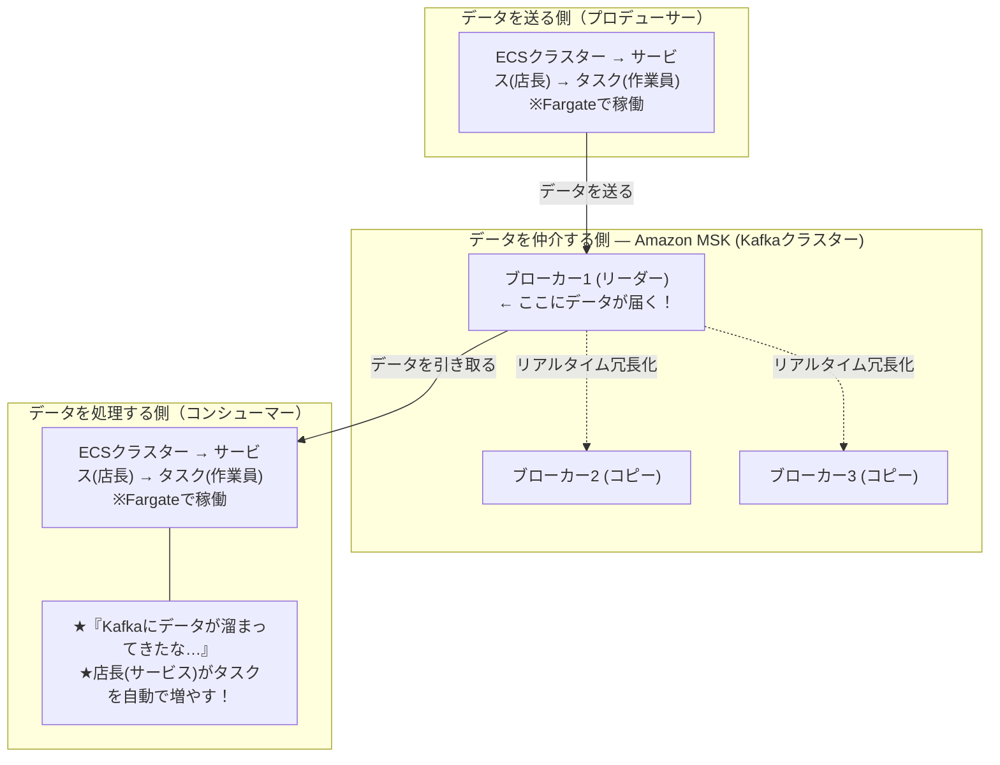

# 【比較】Amazon MSK(Kafka)とECSの違いと連携

AWS上で大量のリアルタイムデータを効率的かつ安全に処理するための2つの主要サービス、**Amazon MSK (Apache Kafka)** と **Amazon ECS** の概念、およびそれらの連携構成についてのまとめです。

## 概要

MSK と ECS は「どちらを選ぶか」という対立サービスではなく、**役割が異なり、組み合わせて使う補完関係**にあります。MSK が「データを運ぶ道路」、ECS が「そのデータを送り出し／処理する作業員」を担います。

| サービス名 | 正式名称 | カテゴリ | 一言でいうと |
| --- | --- | --- | --- |
| **Amazon MSK** | Managed Streaming for Apache Kafka | イベントストリーミング基盤 | 大量のリアルタイムデータを詰まらせず高速に仲介・配信する「堅牢な道路」 |
| **Amazon ECS** | Elastic Container Service | コンテナオーケストレーション | プログラム(コンテナ)を安全かつ自動で動かす「お部屋の管理人」 |

## 詳細比較

### 1. Amazon MSK (Apache Kafka) の概念

> **「大量のリアルタイムデータを、詰まらせることなく高速に仲介・配信するための堅牢な道路」**

#### そもそも Apache Kafka とは？

- **分散イベントストリーミングプラットフォーム**（高機能なメッセージキューシステム）。
- Webサイトのクリックログ、IoTセンサーデータ、金融取引データなど、秒間数万〜数百万件発生するリアルタイムデータを安全に受け取って次に引き渡す「データの交差点」の役割を担う。

#### Amazon MSK とは？

- AWSが提供する **Managed Streaming for Apache Kafka** の略。
- 本来なら構築・運用が極めて難しい Kafka サーバーのセットアップ、パッチ当て、高可用性の確保などを、AWSが裏側ですべて管理してくれる**フルマネージドサービス**。

#### Kafkaのサーバー構成（ブローカーの仕組み）

- **ブローカー (Broker)**: Kafka を構成する1台1台のサーバーのこと（基本構成は3台）。
- **リーダーとフォロワー**: 3台のブローカーはデータごとに「リーダー（メイン窓口）」と「フォロワー（バックアップ機）」に分かれる。
    - データの送受信はまずリーダーが受け付ける。
    - 残りのフォロワーは、リーダーのデータを裏側で一瞬でリアルタイムコピー（冗長化）する。
    - **なぜこの構成？**: 万が一リーダーの1台が故障しても、コピーを持っていたフォロワーが自動的に新しいリーダーに昇格するため、システム全体が止まらない（高可用性）。
- **画面での確認**: AWSコンソール上から「各ブローカーの接続用アドレス（エンドポイント）」や「ブローカーごとの CPU・ディスク・ネットワーク負荷のグラフ」を個別に確認・監視できる。

### 2. Amazon ECS の概念

> **「プログラム（コンテナ）を安全かつ自動で動かしてくれるお部屋の管理人」**

実際にデータを送信したり、届いたデータを計算・処理したりする「アプリケーション」を動かす場所。アパレルショップ（店舗）に例えると、各用語の関係性が簡単に理解できる。

| ECS用語 | 例え | 役割 |
| --- | --- | --- |
| **クラスター (Cluster)** | 店舗の敷地 | すべての土台となる枠組み（インフラのグループ）。「ここにアプリ環境を開くぞ」という場所の確保 |
| **タスク (Task)** | 作業員（コンテナ） | 実際に動くプログラムの最小単位。「データを処理する」マニュアルを持った作業員が1人働いている状態 |
| **サービス (Service)** | 店長（管理システム） | 現場を監督するリーダー。「常にタスクを3人キープ」と命令しておくと、タスクが倒れても即座に新しいタスクを自動補充する |
| **Fargate** | 派遣会社（サーバーレス） | 作業員が働く「机や椅子（サーバーインフラ）」をAWSがすべて用意。EC2管理が不要で従量課金、運用が非常に楽 |

## 全体のつながり（ECS × Kafka）

システム全体としては、**「大量のデータを運ぶ道路（Kafka）」** と **「そのデータを処理する作業員（ECS）」** という綺麗な連携が生まれます。

- **送る側（プロデューサー）**: ECS 上のタスクが生成データを Kafka のリーダーブローカーへ送信する。
- **仲介する側（MSK）**: リーダーが受け取ったデータをフォロワーへ冗長化しつつ、コンシューマーへ引き渡す。
- **処理する側（コンシューマー）**: ECS 上のタスクが Kafka からデータを引き取って処理。溜まり具合に応じてサービス（店長）がタスク数を自動で増減（スケール）させる。

## よくある誤解

- **「MSK か ECS のどちらかを選ぶ」ものではない**: 両者は対立せず、データの「輸送路（MSK）」と「処理する人（ECS）」として組み合わせて使う。
- **「ブローカー3台はただの台数」ではない**: リーダー／フォロワーの役割分担と自動昇格があるからこその高可用性であり、単なる負荷分散用の台数ではない。
- **「Fargate は別のコンテナサービス」ではない**: Fargate は ECS（や EKS）の**起動タイプ＝サーバー管理を肩代わりする仕組み**であって、ECS と並列の別物ではない。

## 実務での選び分け

- **MSK を使う場面**: 秒間数万件規模のリアルタイムデータを、複数の処理側へ確実に・順序を保って配信したいとき（ログ収集基盤、イベント駆動、ストリーム処理）。
- **ECS を使う場面**: その送受信・処理を行うアプリ（プロデューサー／コンシューマー）をコンテナとして安定稼働・自動スケールさせたいとき。
- **組み合わせの典型**: 「ECS(送信) → MSK(仲介・冗長化) → ECS(処理・自動スケール)」。インフラ管理を最小化したいなら ECS の起動タイプは **Fargate** を選ぶ。

## ひとことまとめ

MSK は「データを詰まらせず運ぶ堅牢な道路」、ECS は「そのデータを送り出し・処理する作業員」。両者を **プロデューサー → MSK → コンシューマー** の形でつなぐと、大量のリアルタイムデータを高可用かつ自動スケールで処理できる。

## 出典・参考

- Amazon MSK 公式: <https://aws.amazon.com/jp/msk/>
- Amazon ECS 公式: <https://aws.amazon.com/jp/ecs/>
- AWS Fargate 公式: <https://aws.amazon.com/jp/fargate/>
- Apache Kafka 公式ドキュメント: <https://kafka.apache.org/documentation/>
