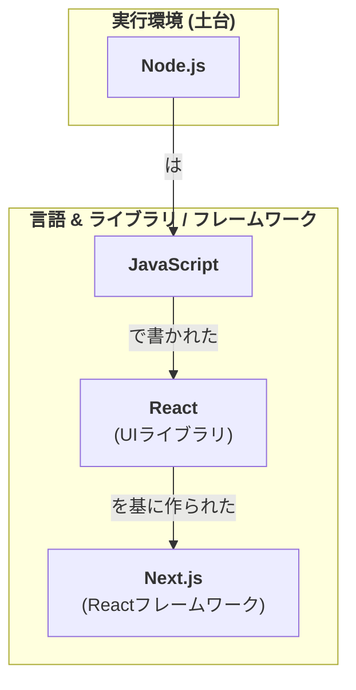

# 【比較】node.jsとnext.jsの違い

## 概要

**Node.js** は、サーバーサイドでJavaScriptを実行するための環境です。本来ブラウザでしか動作しないJavaScriptを、サーバー側で動かせるようにしたもので、WebサーバーやAPIの構築など、主にバックエンド開発に用いられます。公式ドキュメントでは Node.js を「非同期イベント駆動の JavaScript ランタイム」と定義しており、内部では Google の V8 JavaScript エンジンを利用しています。

**Next.js** は、ReactをベースにしたWebアプリケーションを構築するためのフレームワークです。公式は Next.js を「フルスタックの Web アプリケーションを構築するための React フレームワーク」と説明しています。サーバーサイドレンダリング（SSR）や静的サイト生成（SSG）といったモダンなWeb開発に必要な機能が予め組み込まれており、効率的に高機能なフロントエンドを開発できます。

つまり両者は「比べて優劣を決めるもの」ではなく、**土台（Node.js）とその上で動く道具セット（Next.js）**という階層関係にあります。

## 詳細比較

| 項目 | Node.js | Next.js |
| :--- | :--- | :--- |
| **分類** | JavaScript実行環境（ランタイム） | Reactフレームワーク |
| **主な用途** | バックエンド開発（Webサーバー、API、CLIツールなど） | フロントエンド／フルスタック開発（Webサイト、Webアプリケーション） |
| **立ち位置** | 基盤となる環境 | アプリケーションを構築するための骨組み |
| **抽象度** | 低レベル（HTTPサーバーなど基本的な機能を提供） | 高レベル（ルーティング、レンダリング手法など多くの機能が組み込み済み） |
| **依存関係** | 単体で動作する | Node.js 環境の上で動作する |
| **内部技術** | V8 エンジン上で JavaScript を実行 | React コンポーネント＋バンドラ・コンパイラを自動構成 |

### 関係性

Next.jsはNode.jsの環境上で動作します。つまり、Next.jsで開発されたアプリケーションを実行（開発サーバーやビルド、本番サーバー）するためには、Node.jsがインストールされている必要があります。Next.js は内部でバンドラやコンパイラといった低レベルのツールを自動的に設定するため、開発者は設定よりもプロダクト開発に集中できます。

## よくある誤解

- **誤解1：「Node.js と Next.js はどちらが優れているか比較して選ぶもの」** — 誤りです。両者は競合関係ではなく**補完関係**です。Node.js は JavaScript を動かす実行環境（土台）であり、Next.js はその土台の上で動く React 製フレームワークです。Next.js を動かすこと自体が Node.js を必要とします。
- **誤解2：「Node.js は言語である」** — 誤りです。言語は JavaScript で、Node.js は JavaScript を**サーバーサイドで実行するランタイム**です。公式定義も「JavaScript runtime」であり、独自言語ではありません。
- **誤解3：「Next.js はフロントエンド専用」** — 不正確です。Next.js 公式は「フルスタックの Web アプリケーションを構築するための React フレームワーク」と説明しており、Route Handlers（API ルート）などサーバーサイド機能も備えます。UI 構築だけのツールではありません。
- **誤解4：「Next.js と Nuxt.js は同じものの綴り違い」** — 誤りです。Next.js は **React** ベース、Nuxt.js は **Vue.js** ベースの、それぞれ別のフレームワークです（後述の補足参照）。

## 実務での選び分け

そもそも「どちらか一方を選ぶ」性質のものではなく、用途に応じて**組み合わせて使う**のが基本です。

- **素の API サーバーや CLI ツール、軽量な HTTP サーバーを作りたい** → Node.js（必要なら Express など軽量フレームワークを併用）。React 製の UI が不要なケース。
- **React で SSR/SSG を含む本格的な Web サイト・Web アプリを効率よく作りたい** → Next.js。ルーティング・レンダリング戦略・最適化が組み込み済みで、これ自体が Node.js 上で動く。
- **Vue で同様のことをしたい** → Node.js 上で動く Nuxt.js を選ぶ（React にとっての Next.js に相当）。
- **判断軸**：①React／Vue を使うか（UI ライブラリの選択） ②SSR/SSG など高レベル機能を自前構築したくないか ③土台（Node.js）は基本どのケースでも必要、という前提を押さえる。

## ひとことまとめ

Node.js は「JavaScript をサーバーで動かす土台（ランタイム）」、Next.js は「その土台の上で React 製の高機能サイトを効率よく作る道具セット」。両者は競合ではなく、Next.js が Node.js を利用する補完関係です。

料理に例えるなら、Node.jsが「ガスコンロや調理器具」といったキッチンのインフラで、Next.jsは「特定の料理（例：フランス料理）を作るためのレシピと、それに特化した調理器具のセット」と考えることができます。

### 補足：Vue.jsの場合

ご質問の通り、Vue.jsもNode.jsと同様の関係性にあります。

ReactにとってのNext.jsのように、Vue.jsには**Nuxt.js**という代表的なフレームワークが存在します。Nuxt.jsもサーバーサイドレンダリングなどの機能を提供し、その実行にはNode.jsが必要です。

- **Node.js**: 実行環境（土台）
- **Vue.js**: UIを構築するためのフレームワーク
- **Nuxt.js**: Node.js上で動作する、Vue.jsベースのフレームワーク

このように、Vue.jsでの開発においてもNode.jsは土台として利用されており、「Node.jsの上でVue.js（やNuxt.js）が動く」というイメージは正しいです。

### 補足：Next.jsとNuxt.jsの違い

`Next.js`と`Nuxt.js`は名前が似ていますが、それぞれ異なるライブラリ／フレームワークを基盤とする**別のフレームワーク**です。記載間違いではありません。

- **Next.js**: **React** をベースにしたフレームワーク
- **Nuxt.js**: **Vue.js** をベースにしたフレームワーク

両者はそれぞれのライブラリ（ReactとVue.js）で高機能なWebアプリケーションを効率的に開発するという共通の目的を持っているため、「ReactにとってのNext.js」、「Vue.jsにとってのNuxt.js」という対比で語られることが多くあります。

### 図解

## 出典・参考

- Node.js 公式「About Node.js」（Node.js は非同期イベント駆動の JavaScript ランタイム。スケーラブルなネットワークアプリ構築のために設計）: https://nodejs.org/en/about
- Next.js 公式ドキュメント（Next.js はフルスタックの Web アプリケーションを構築するための React フレームワーク。React コンポーネントで UI を作り、Next.js が追加機能と最適化を担う。ルーティング・SSR・SSG・Route Handlers 等を提供）: https://nextjs.org/docs
- React 公式サイト（The library for web and native user interfaces — UI を構築するための JavaScript ライブラリ、コンポーネントベース）: https://react.dev/
- Nuxt 公式サイト（Vue ベースのフルスタックフレームワーク）: https://nuxt.com/
