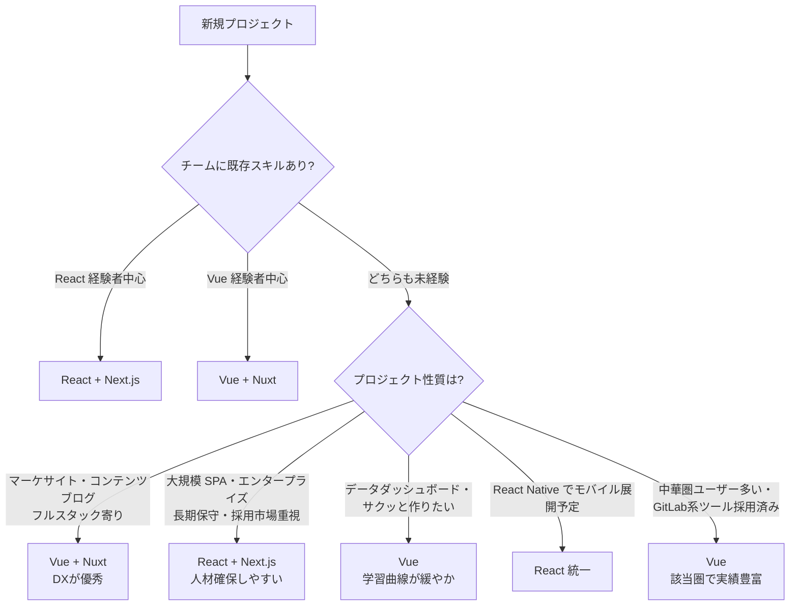

# 【比較】Vue と React の違い（2026年版）

> 📌 既存記事 [React・Vue・Streamlit の違い](./react-vue-streamlit.md) は3者の「役割・領域」の違いを扱った安定版です。本記事は **2026年最新（React 19 ＋ Vue 3.5 Vapor Mode）** の機能・性能・エコシステムにフォーカスした volatile 版です。

## 概要

**Vue** と **React** は、どちらも JavaScript で Web の UI を作るための代表的なフロントエンドツールで、もう10年近く競合関係にあります。2026年時点の最大の違いはこうです:

- **React 19** … Server Components が production-stable に到達。サーバー側でレンダリング → クライアントに JS を送らない設計が広く実用域へ。Next.js / Remix が中心。
- **Vue 3.5** … Vapor Mode（仮想 DOM をバイパスして DOM 操作命令を build 時にコンパイルする新戦略）が登場。一部ベンチで React より速い結果が出始めた。Nuxt が中心。

エコシステム規模では React が圧倒的（**npm 週間 DL 約 8500万 vs Vue 870万、約10:1**）ですが、性能差は2026年に縮小し、Vue は学習コストとテンプレートの読みやすさで根強い支持があります。本記事は **2026-05 時点** の情報で違いをまとめます。

## 詳細比較

| 項目 | Vue 3.5 | React 19 |
| --- | --- | --- |
| **作者・運営** | Evan You ＋ コミュニティ | Meta（旧 Facebook）＋ コミュニティ |
| **コーディング流派** | テンプレート構文（`.vue` 単一ファイル + script/style/template） | JSX（JavaScript 内に HTML 風記述） |
| **状態管理** | リアクティブシステム標準内蔵（`ref` / `reactive`）／公式 Pinia | useState / useReducer ／ Redux / Zustand / Jotai 等 |
| **レンダリング戦略（2026新規）** | **Vapor Mode**（仮想 DOM をバイパス、build時にDOM命令へコンパイル、+36%のDOM操作性能） | **Server Components**（サーバー側render・クライアントJSゼロのコンポーネント、本番安定化） |
| **First Contentful Paint（実測例）** | 標準 0.9s / Vapor Mode **0.7s** | React 19.2 **0.8s** |
| **Interaction to Next Paint（INP）** | やや有利（リアクティブが効率的） | RSC で初回が速いが、クライアント側の差はわずか |
| **公式メタフレームワーク** | **Nuxt 3**（Nitro バックエンド統合、エコシステムスリム） | **Next.js 15+ / Remix**（フルスタック寄り、巨大エコシステム） |
| **学習曲線** | 緩やか（HTML 寄りテンプレート） | 急（JSX＋関数型思考＋hook ルールが壁） |
| **エコシステム規模** | npm 週間 DL **約 870万** / Stack Overflow 採用率 **17.6%** | npm 週間 DL **約 8500万** / Stack Overflow 採用率 **44.7%** |
| **TypeScript 親和性** | 3.x で大幅改善、`<script setup lang="ts">` で快適 | 元から極めて高い、業界標準的 |
| **UI ライブラリ** | Vuetify / PrimeVue / Naive UI | MUI / shadcn/ui / Mantine / Chakra UI（圧倒的多数） |
| **企業採用** | GitLab / Alibaba / 任天堂（一部）／中小〜中堅 SaaS で多い | Meta / Netflix / Airbnb / Shopify／大手・エンタープライズで標準 |
| **求人市場（2026）** | 限定的・案件数で React の 1/5 程度 | 圧倒的多数、フロントエンド求人の事実上のデファクト |
| **モバイル展開** | NativeScript-Vue / Ionic / Quasar | React Native（事実上の標準） |
| **PR・コミット活動** | 安定・着実 | 高活発・破壊的変更も多い（hooks → suspense → RSC） |
| **コミュニティ気質** | 穏やか・公式ドキュメント充実 | 巨大・ライブラリ選定の沼が起きやすい |

> 📅 **取得日**: 2026-05-20。性能・採用率・DL数は変動が速いため、本番採用判断時は必ず一次ソース（後述「出典・参考」）で再確認してください。

## よくある誤解

### 誤解1: 「React のほうが速い」「Vue のほうが速い」

2026年時点では **どちらか一方が常に速いという状況は終わっている** と考えるのが正確です。React 19 の Server Components は初回表示で強く、Vue 3.5 の Vapor Mode はインタラクション後の DOM 操作で強い。**実測では用途による**ため、ベンチマーク1つで判断しないこと。

### 誤解2: 「Vue は小規模、React は大規模」

これは半分正しく半分古い情報です。GitLab・Alibaba 級の大規模 Vue 採用は実在し、逆に小さい SPA で React を選ぶ案件も多数あります。**規模よりも「チームの既存スキル」と「将来の採用市場」で選ぶほうが現実的**。

### 誤解3: 「Vapor Mode が出たから Vue に乗り換えるべき」

Vapor Mode は **eligible（適格）なコンポーネントのみ対象** で、既存の Vue 3 全体が自動で速くなるわけではありません。template 構文の限定的な書き方を要求する場合があり、移行前にプロジェクト要件と適合性を検証する必要があります。

### 誤解4: 「Server Components があれば SPA は不要」

React 19 の Server Components は **クライアントコンポーネントと共存** する設計です。完全な SSR/SSG ではなく、インタラクティブ部分はクライアントで動きます。Vue 側の Nuxt も同様にハイブリッドな構成が可能で、「SC があるから別格」ではありません。

### 誤解5: 「JSX のほうが TypeScript と相性が良い」

これは過去の話。Vue 3.x の `<script setup lang="ts">` と Volar によって、`.vue` 内 TypeScript の体験は React と遜色ないレベルまで到達しています（IDE 補完・型推論ともに）。

## 実務での選び分け

### 判断軸の早見表

| こういうとき | 推奨 |
| --- | --- |
| エンタープライズ大規模 SPA・長期保守 | **React + Next.js**（人材確保しやすい、デファクトの安心感） |
| マーケサイト・コンテンツ重視・SEO | **Vue + Nuxt**（Nitro 統合で DX 高い、SSR/SSG が素直） |
| 学習コスト最優先（教育コスト含む） | **Vue**（HTML 寄りで初学者に優しい） |
| モバイルアプリも作る予定 | **React + React Native**（コード共有しやすい） |
| 採用市場・転職市場重視 | **React**（求人数が圧倒的） |
| 性能の極限を狙う（DOM 操作集中型） | **Vue 3.5 Vapor Mode**（適格コンポーネントで +36%） |
| 性能の極限を狙う（初回表示・SEO） | **React 19 Server Components** |
| すでにチームのスキルが偏っている | **既存スキル**（移行コスト＞言語的優位） |
| データサイエンス・社内ダッシュボード | （別記事参照: [React・Vue・Streamlit の違い](./react-vue-streamlit.md) → **Streamlit** が有力） |

## ひとことまとめ

**2026年は「どちらでも勝てる」時代**になりました。性能差はベンチマーク次第で逆転し、TypeScript 親和性も並びました。**決め手はチームの既存スキルと採用市場**で、迷ったら採用市場で圧倒的に強い **React + Next.js** を、フルスタック DX と学習コストを優先するなら **Vue + Nuxt** を選ぶ、という整理が現実的です。技術論争に時間を使うより、「3年後にこのコードを誰がメンテするか」で決めるのが2026年の正攻法です。

## 出典・参考

> 📅 全リンク取得日: **2026-05-20**

- [Vue 3 vs React in 2026: Choosing the Right Framework（James Ross Jr.）](https://www.jamesrossjr.com/blog/vue-3-vs-react-2026)
- [Vue vs React 2026: Full Comparison + Decision Guide（GroovyWeb）](https://www.groovyweb.co/blog/vue-vs-react-comparison-2026)
- [Vue vs React: A Complete 2026 Comparison（The Frontend Company）](https://www.thefrontendcompany.com/posts/vue-vs-react)
- [React vs Vue: 7 Benchmarks Show a Clear Winner [2026]（tech-insider）](https://tech-insider.org/react-vs-vue-2026/)
- [Vue vs React 2026: 5x Download Gap and 93% Retention（tech-insider）](https://tech-insider.org/vue-vs-react-2026/)
- [Angular vs. React vs. Vue.js: A performance guide for 2026（LogRocket Blog）](https://blog.logrocket.com/angular-vs-react-vs-vue-js-performance/)
- [React 19 vs Vue 3.6 vs Svelte 5: 2026 Framework Convergence（byteiota）](https://byteiota.com/react-19-vs-vue-3-6-vs-svelte-5-2026-framework-convergence/)
- [The Future of Vue: Vapor Mode（Vue Mastery）](https://www.vuemastery.com/blog/the-future-of-vue-vapor-mode/)
- [React vs Vue in 2026: What the npm Data Actually Says（DEV Community）](https://dev.to/royce_fabbd83cb268312e928/react-vs-vue-in-2026-what-the-npm-data-actually-says-4nll)
- [JavaScript Framework Trends in 2026（Nucamp）](https://www.nucamp.co/blog/javascript-framework-trends-in-2026-what-s-new-in-react-next.js-vue-angular-and-svelte)
